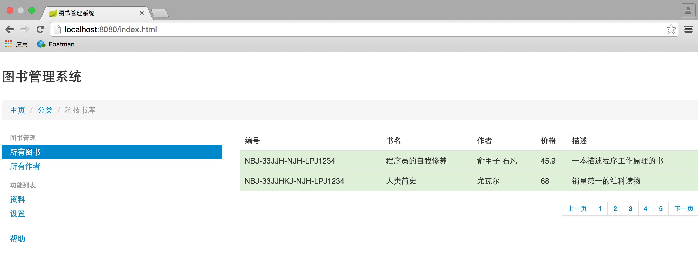

# 图书销售推荐系统

## 简介
图书馆信息管理系统

## API
* 获取所有图书：GET /api/books
* 获取图书：GET /api/books/{id}
* 新增图书：POST Book /api/books
* 删除图书：DELETE /api/books/{id}

## 运行
1. 导入Maven工程
2. 设置vm参数：-Dspring.profiles.active=test
3. 运行Main方法
4. 在浏览器内输入http://localhost:8080/index.html查看
